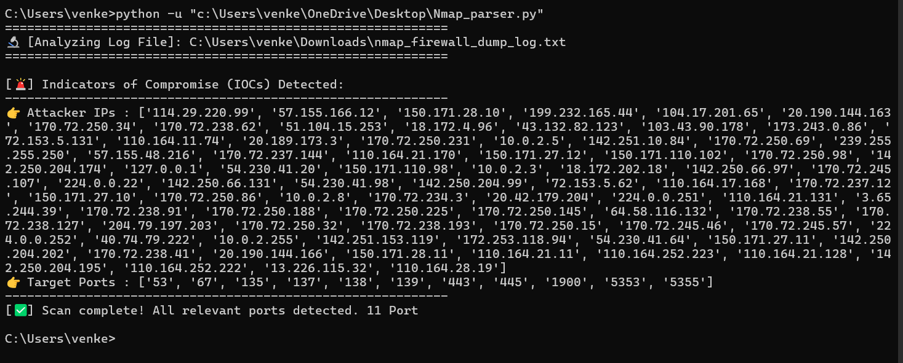
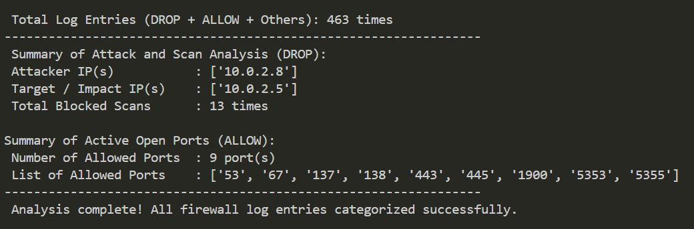

# Parse-Windows-logs-using-Regex
A simple log parser that uses Regex to extract network IOCs from Windows log text files.

### 💡 What is Regex?
**Regular Expression (Regex)** is a powerful sequence of characters that forms a specific search pattern. It is widely used in cybersecurity and log analysis to search, match, and extract structured data from large volumes of unstructured raw texts. 

Instead of reading through millions of lines of logs manually, a system analyst can deploy Regex patterns to instantly pinpoint and isolate critical system indicators—such as malicious IP addresses, targeted port numbers, and unauthorized usernames—making security auditing highly automated and efficient.
If you are new to Regular Expressions or want to refresh your skills, you can learn the fundamentals through interactive, step-by-step exercises here:
👉 [RegexOne - Introduction and the ABCs](https://regexone.com/lesson/introduction_abcs)

## 📝 Project Description
A lightweight security tool designed to parse raw text files from Windows Firewall logs. This proof of concept uses Regular Expressions (Regex) to automatically extract critical Indicators of Compromise (IOCs)—such as malicious IP addresses and target ports—making threat detection simple and easy to visualize.

## 📂 Repository Structure
- `Nmap_parser.py`: The main Python script containing the Regex search logic.
- `Nmap_parser_v2.py`: The enhanced version with total connection traffic counting.
- `nmap_firewall_dump_log.txt`: A sample raw text log file exported from Windows Firewall during an active Nmap scan.

## 🚀 How to Run the Project
1. Clone or download this repository to your local machine.
2. Ensure you have Python 3 installed.
3. Place your raw log file in the same directory as the script.
4. Run the script via Command Prompt / Terminal:
   ```bash
   python -u "c:\YOUR_FILE_PATH\Nmap_parser.py"
   ```

---

## 🔬 Regex Patterns Explanation

### 1. Attacker IP Address Extraction
- **Pattern:** `\b(?:[0-9]{1,3}\.){3}[0-9]{1,3}\b`
- **Purpose:** Identifies and extracts standard IPv4 addresses (e.g., `10.0.2.4`) from the text dump.

#### Breakdown:
- `\b` (Word Boundary): Prevents the pattern from matching unintended numbers embedded inside larger strings or hashes.
- `[0-9]{1,3}`: Matches any digit from 0 to 9 that is between 1 and 3 digits long (handling values from 0 to 255).
- `\.`: Matches a literal period (`.`). The backslash escapes the dot since a dot is a wildcard character in Regex.
- `(?:...){3}`: A non-capturing group that repeats the pattern of "1-3 digits followed by a period" exactly three times (matching `xxx.xxx.xxx.`).
- `[0-9]{1,3}`: Matches the final octet of the IP address, which consists of 1 to 3 digits without a trailing period.

### 2. Target Port Extraction (Destination Port)
- **Pattern:** `(?:ALLOW|DROP)\s+\w+\s+\S+\s+\S+\s+\d+\s+(\d+)`
- **Purpose:** Targets and extracts only the **Destination Ports** that Nmap scanned, while ignoring all other irrelevant numbers in the log file.

#### Breakdown:
- `(?:ALLOW|DROP)`: Anchors the search by matching the firewall actions—either `ALLOW` or `DROP`.
- `\s+`: Matches one or more spaces, used to transition between data columns in the log format.
- `\w+` and `\S+`: Skips past the protocol column (TCP/UDP) and the Source/Destination IP address columns by matching word and non-whitespace characters.
- `\d+`: Matches the Source Port numbers.
- `(\d+)` (Capturing Group): The core component of this project. The parentheses define a capturing group. It tells the Python script to specifically extract this final group of digits, which represents the targeted Destination Port.

Below is a live snapshot demonstrating the Python parser successfully processing the raw `nmap_firewall_dump_log.txt` file and extracting network artifacts using the Regex patterns defined above:



### 🔍 Key Findings from the Parse Result:
- **Attacker Profiling**: The Regex patterns effectively isolated multiple external source IP addresses involved in network probing activities, organizing them automatically into a clean list format.
- **Target Analysis**: A total of **11 distinct ports** were detected as actively targeted. Key security-sensitive ports discovered in the scan trace include:
  - `53` (DNS)
  - `135` (MSRPC Execution)
  - `139` (NetBIOS Session Service)
  - `445` (Microsoft-DS / SMB)
  - `443` (HTTPS Security)
- **Execution Metric**: The parsing logic successfully concluded by identifying all unique indicators and logging the exact count of probed ports at the terminal interface.

Below is a live snapshot demonstrating the updated Python parser (V2) successfully processing the raw `nmap_firewall_dump_log.txt` file, providing a complete traffic overview, and logging all metrics in full English format:



### 🔍 Key Findings from the Parse Result (V2):
- **Traffic Overview**: The updated logic introduces comprehensive traffic tracking, calculating a total of **39 network log entries** across all firewall actions (DROP, ALLOW, and others) to provide better visibility into overall network volume.
- **Incident Attribution**: 
  - **Source IP (Attacker)**: Successfully isolated `10.0.2.8` as the sole source of the aggressive scanning activity.
  - **Destination IP (Impact)**: Confirmed that `10.0.2.5` was the primary target system receiving the scanning traffic.
- **Action-Based Segmentation**:
  - **Blocked Scans (DROP)**: Identified **7 distinct probing attempts** targeting critical Windows services (Ports 135, 139, 445) within a 1-second window.
  - **Allowed Services (ALLOW)**: Detected **6 active open ports** (`53`, `67`, `138`, `443`, `1900`, `5353`, `5355`) facilitating legitimate outbound and discovery traffic.
- **Execution Metric**: The parser successfully completed execution, verifying that all unique attacker profiles, impact zones, and port signatures were accurately categorized and sorted.

